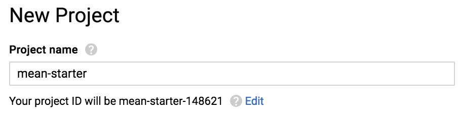
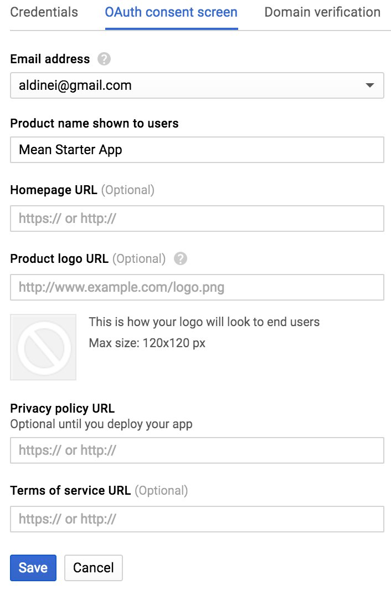
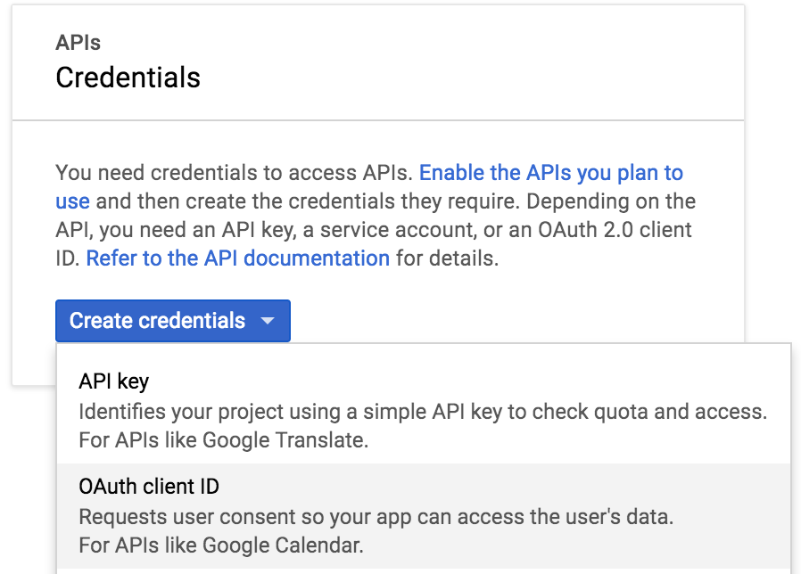
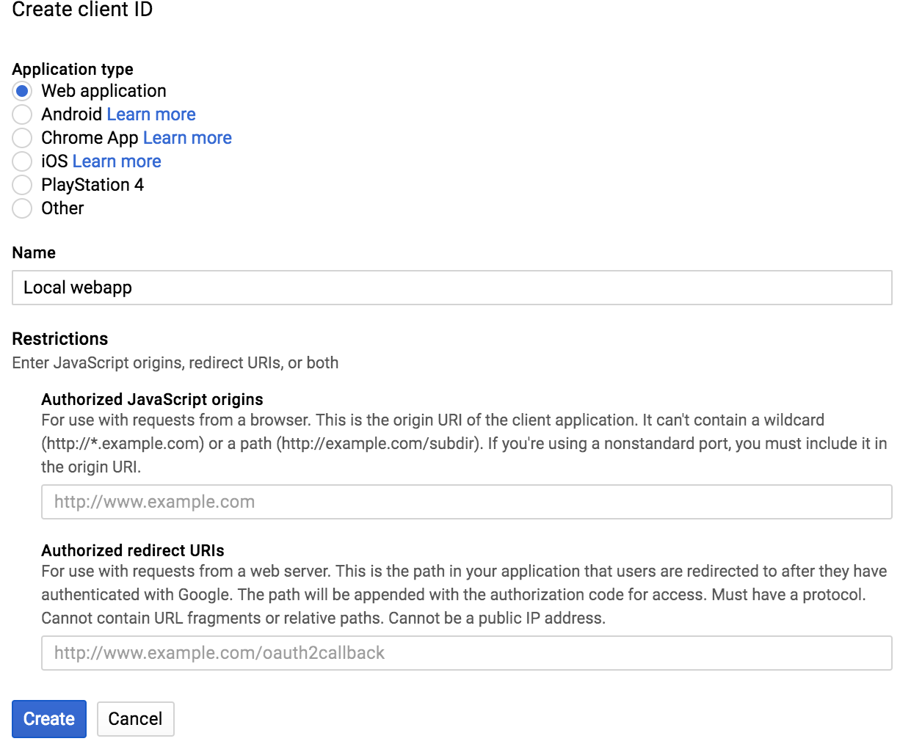
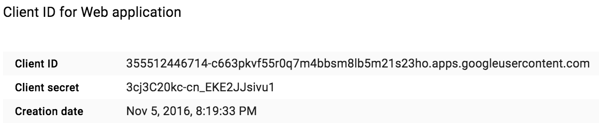

# MongoDB, Express, Node 6, Angular 2 Starter

## Google Oauth

- Access [Google API Console](https://console.developers.google.com)
- Create a project (mean-starter)

- Setup the consent screen

- Create credentials

- Create a client ID for localhost test

- Get the client ID to setup Passport

## References
* [Using OAuth 2.0 to Access Google APIs](https://developers.google.com/identity/protocols/OAuth2)